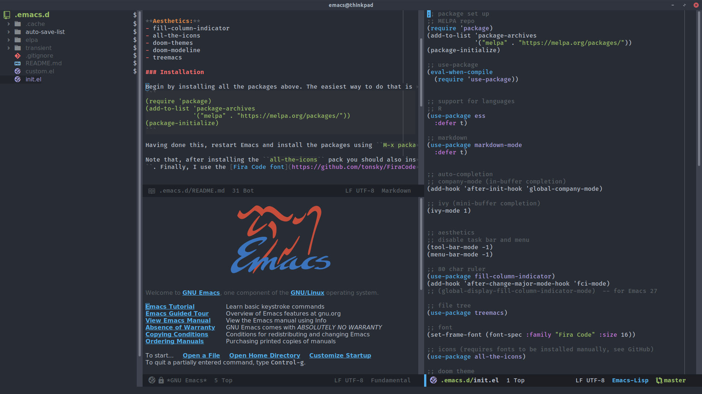

# Just another Emacs config

This is a simple Emacs init file which aims to be short and easily understandable. It sets up Emacs to look like a modern text editor (with a dark theme and new icons, mode line and font) and adds some IDE-like functionality (code completion with a drop-down menu and a tree file explorer). It also installs modes for coding in R, LaTeX and Markdown and sets some additional options (a package for git and a new location for saving Emacs' backup files (the automatically created ones that start with `~`)).

My aim in building this configuration was to see how much set up was needed to get Emacs to look and act (in the basic respects that I find most helpful) like a modern editor such as Atom or Sublime. As you can see by looking at this `init.el` file, a new theme, font and a few other packages are all that is needed.

I have recently started to use [Evil](https://github.com/emacs-evil/evil) mode and I have found Vim-style keybindings to be much more ergonomic than the Emacs default. This config uses Evil by default but it can be easily switched off commenting the relevant lines towards the end of the init file.

### Packages

This configuration uses the following packages, listed here by category:

  - **Code completion:**
    - [Ivy](https://github.com/abo-abo/swiper) (general completion)
    - [Company](https://company-mode.github.io/) (standard in-buffer drop-down completion)

  - **Language support:**
    - [ESS](https://ess.r-project.org/) (for R)
	- [AUCTeX](https://www.gnu.org/software/auctex/) (for LaTeX)
    - [Markdown](https://jblevins.org/projects/markdown-mode/) (for Markdown)

  - **Tools:**
    - [Magit](https://magit.vc/) (for Git)

  - **Aesthetics:**
    - [all-the-icons](https://github.com/domtronn/all-the-icons.el) (icons)
    - [DOOM Themes](https://github.com/hlissner/emacs-doom-themes) (main theme)
    - [doom-modeline](https://github.com/seagle0128/doom-modeline) (mode line)
    - [Treemacs](https://github.com/Alexander-Miller/treemacs) (tree file browser)
    - [org-bullets](https://github.com/sabof/org-bullets) (shows `org-mode` bullets as UTF-8 characters)

  - **Misc:**
    - [use-package](https://github.com/jwiegley/use-package) (improves the init file package configuration)
	

### Installation

Simply place the `init.el` file in your `.emacs.d` folder (in a Unix system this will be located in your home directory by default). If you already have an `init.el` file in your Emacs folder, or an equivalent `.emacs` file in your home directory, you must delete/overwrite these.

Note that to use the [Fira Code font](https://github.com/tonsky/FiraCode) for code and [Source Sans Pro](https://fonts.google.com/specimen/Source+Sans+Pro) for `org-mode` text you must install them on your system in a separate step.

### Screenshot

